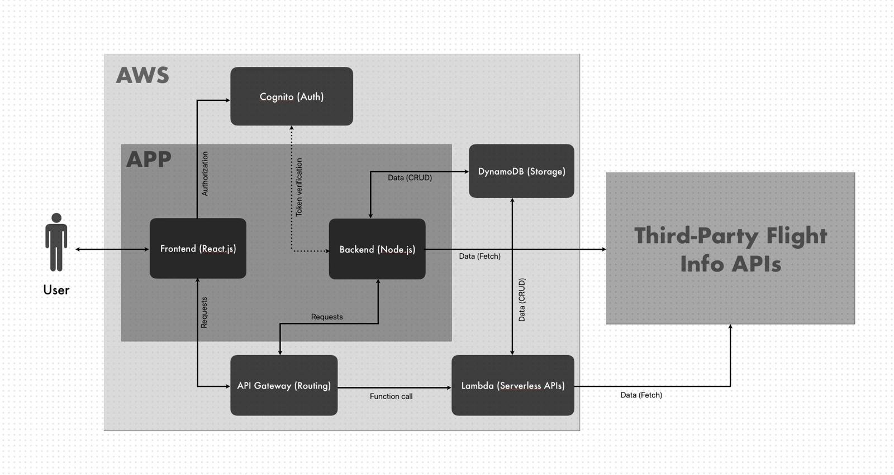
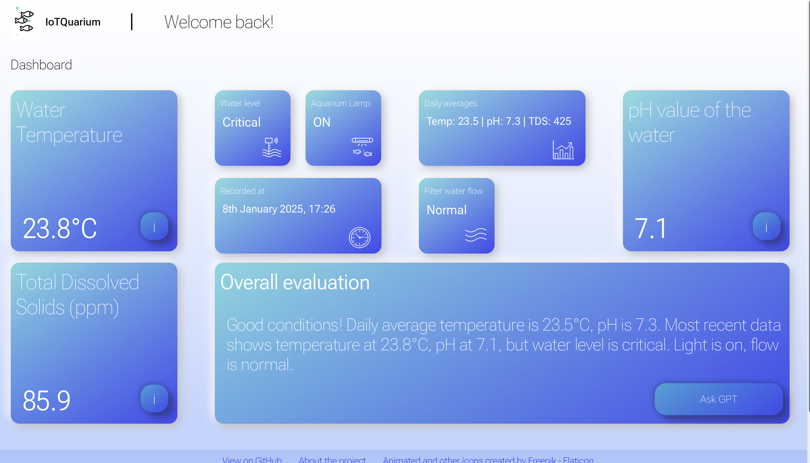
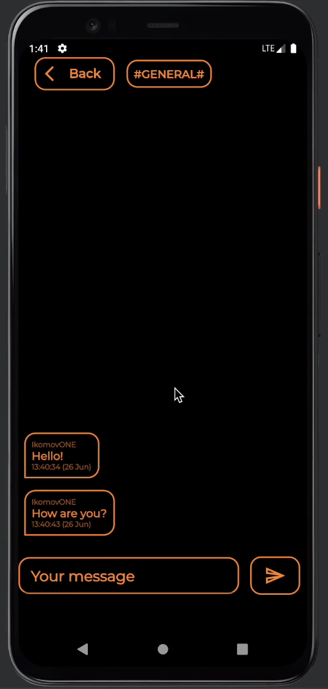

# 👋 Hi, I'm Daniil, nice to meet you!

🎓 Master’s student, studying Digital Systems and Service Development at LUT 

💻 Junior Software Engineer

🌍 Based in Lahti, Finland — open to relocate  

I'm a reflective and driven software engineer with a strong background in digital systems, backend development, and real-world collaboration. Currently building a real-time **Flight Tracker** and continuously exploring systems integration, IoT, and user-focused design.

---

## 🚀 Projects

### ✈️ Flight Tracker (In Progress)
A real-time global flight tracking tool with API integration and a clean, responsive interface.

- Focused on **real-time API communication**
- Emphasis on **UX optimization** and performance
- Exploring aviation data visualization and user interactivity
- Integrating the app within AWS cloud services

 

 

---

### 🐠 IoTQuarium Monitoring
A full-stack aquarium monitoring system built for real-time sensor tracking and daily analysis.

- Built with **FastAPI** backend and **Vue.js** frontend
- Features chatGPT integration for status updates and guidance
- Runs on **Raspberry Pi 5**, connected to 6 sensors (pH, TDS, temp, light, water level, flow)
- Uses **MongoDB** for logging and computing daily stats
- Two-threaded sensor data pipeline with real-time alerts

 

 

 
  

---

### 💬 Messenger App (Flutter mini-project)
Flutter messenger application with cloud-based integration through Google Firebase

- Built with **Flutter**
- Features authentication with credentials and hashing
- Uses Google firebase for storage and authentication
- Cool animations and live chats

 

### 🏗️ Capstone Project @ Triplan Oy
Backend engineer and integration developer for a B2B construction software launchpad.

- Contributed to internal tooling and API design
- Worked in an agile **Scrum** team with real client requirements
- Part of the **Capstone collaboration project** at LUT University

---

## 🛠️ Tech Stack

**Languages:**  
Python • Java • Dart • JavaScript • HTML/CSS

**Frameworks & Libraries:**  
FastAPI • Node.js • React • Vue.js • Flutter

**Tools & Platforms:**  
Docker • Git • Firebase • MongoDB • SQL • Nginx • Jira • Scrum • Parametrization

---

## 🌍 Languages

- 🇷🇺 Russian — Native  
- 🇬🇧 English — Advanced (C1/C2)  
- 🇫🇮 Finnish — Intermediate (B1)  
- 🇨🇳 Chinese — Basic (A1)

---

## 📫 How to reach me

📍 Lahti, Finland  
📧 daniil_komov@icloud.com  
🔗 [LinkedIn](https://linkedin.com/in/daniilkomov)  
🌐 [GitHub](https://github.com/daniilkomov)

---

⭐️ _Fun fact: My guppies (and 1 suckerfish) now live in a smarter aquarium than most offices._

<!-- Optional: Add GitHub Stats or Badges here later -->
